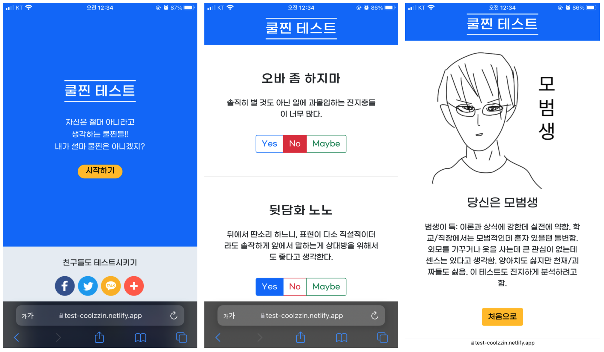

# coolzzin-test
내가 설마 쿨찐? 간단한 테스트를 통해 알아보는 웹사이트입니다.

## 1. 목표와 기능
### 1.1 목표
- Bootstrap의 활용
- 웹사이트의 배포 및 DNS 구매를 통한 도메인 연결
- SNS 공유 기능, 배너 광고 넣기
- SEO 최적화 과정 이해

### 1.2 기능
- 주어진 질문에 본인의 성향대로 답변을 하면 쿨찐인지 아닌지 결과를 알려줍니다.
- 각종 SNS로 공유할 수 있습니다.

## 2. 개발 환경 및 배포 URL
### 2.1 개발 환경
- 서비스 배포 환경
  - Netlify
### 2.2 배포 URL
- https://test-coolzzin.netlify.app/

## 3. 프로젝트 구조
```
.
├── favicon.ico
├── img
│   ├── 1.png
│   ├── 2.png
│   ├── 3.png
│   ├── 4.png
│   ├── 5.png
│   └── coolzzin-test.png
├── index.html
├── naverb178bbbab50ffac20497e0d6c29a1414.html
├── result
│   ├── a8ds7fs9.html
│   ├── b2ldsio9.html
│   ├── cl4odifs7.html
│   ├── dg0s8dfa.html
│   └── e4jsl97d.html
├── script.js
├── style.css
└── test.html

```

## 4. 실행 화면


## 5. 개발하며 느낀 점
- result의 html 파일 이름이 1.html, 2.html, ..., 5.html이었는데, 한 번만 테스트하고 주소창에서 숫자만 바꿔
모든 결과를 추측할 수 있겠다는 지인의 말을 듣고 result 파일을 난독화했습니다. 서비스를 제작할 때 보안적인 측면도 항상 고려해야 함을 깨달았습니다. 
